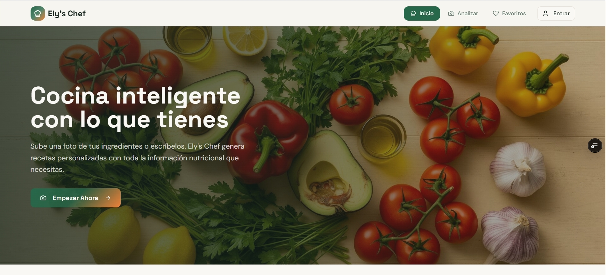
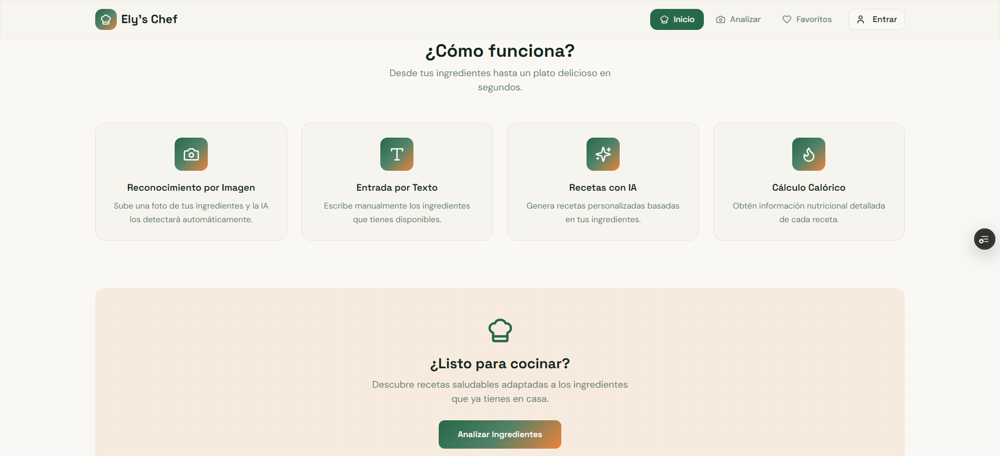
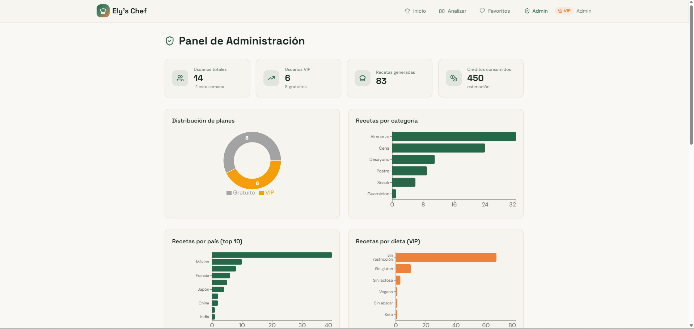

# Ely's Chef

**Aplicación web de recetas inteligentes impulsada por IA.**
Introduce los ingredientes que tienes en casa — por texto o fotografía — y obtén recetas personalizadas con información nutricional completa en segundos.

> Trabajo de Fin de Grado · Ciclo Formativo de Grado Superior en Desarrollo de Aplicaciones Multiplataforma (DAM)

---

## Demo en vivo

**[elys-chef.vercel.app](https://elys-chef.vercel.app)**

| Pantalla principal | Generación de recetas | Panel de administración |
|---|---|---|
|  |  |  |

---

## Funcionalidades principales

- **Reconocimiento de ingredientes por imagen** — sube una foto y la IA identifica los ingredientes automáticamente
- **Entrada de ingredientes por texto** — añade y edita ingredientes de forma manual
- **Generación de recetas con IA** — recetas personalizadas basadas en tus ingredientes y preferencias
- **Información nutricional detallada** — calorías, macronutrientes y datos de cada receta
- **Filtros avanzados** — filtra por país de origen, categoría y tipo de dieta
- **Sistema de alergias (VIP)** — la IA excluye ingredientes según tus alergias registradas
- **Favoritos** — guarda y consulta tus recetas favoritas
- **Descarga en PDF** — exporta cualquier receta en formato PDF
- **Sistema de créditos** — plan gratuito (200 créditos) y plan VIP (500 créditos); generar recetas cuesta 50 créditos y analizar una imagen 25
- **Panel de administración** — gestión de usuarios, catálogos y configuración del sistema
- **Exportación a Excel** — el administrador puede descargar un informe `.xlsx` con KPIs, estadísticas de usuarios, distribución por países, categorías, dietas y alergias

---

## Stack tecnológico

| Capa | Tecnología |
|---|---|
| **Frontend** | React 18 · TypeScript · Vite |
| **UI / Estilos** | Tailwind CSS · shadcn/ui · Radix UI · Lucide Icons |
| **Enrutamiento** | React Router v6 |
| **Estado del servidor** | TanStack React Query v5 |
| **Formularios y validación** | React Hook Form · Zod |
| **Backend / Base de datos** | Supabase (PostgreSQL + Auth + Storage) |
| **Inteligencia Artificial** | Groq API (generación de recetas e imágenes, reconocimiento de ingredientes) |
| **Exportación PDF** | jsPDF |
| **Exportación Excel** | xlsx-js-style (SheetJS) |
| **Testing** | Vitest · Testing Library |
| **Despliegue** | Vercel |

---

## Arquitectura del proyecto

La aplicación sigue un patrón **MVC adaptado a React** con separación clara de responsabilidades en cuatro capas:

```
supabase/
├── functions/                         # Edge Functions Deno (backend serverless)
│   ├── generate-recipes/              # Generación de recetas con Groq (Llama-3.3-70b)
│   ├── recognize-ingredients/         # Reconocimiento de ingredientes por imagen (Llama 4 Scout)
│   ├── generate-recipe-image/         # Búsqueda de imágenes en Pexels
│   ├── search-recipes/                # Búsqueda y filtrado de recetas en BD
│   └── _shared/
│       ├── groq.ts                    # Cliente Groq con reintentos exponenciales
│       └── credits.ts                 # Validación y deducción de créditos
└── migrations/                        # Migraciones PostgreSQL

src/
├── pages/           # Vistas principales (Index, Analyze, Favorites, Profile, Admin, Auth, NotFound)
├── components/      # Componentes reutilizables de UI
│   └── ui/          # Librería de componentes base (shadcn/ui)
├── controllers/     # Custom hooks con lógica de negocio
│   ├── use-recipe-generator.ts       # Orquestador del flujo completo de generación
│   ├── use-ingredient-recognition.ts # Reconocimiento de ingredientes por imagen (IA)
│   ├── use-auth-controller.ts
│   ├── use-favorites-controller.ts
│   ├── use-profile-controller.ts
│   └── use-admin-controller.ts
├── models/          # Servicios de acceso a datos y llamadas a Edge Functions
│   ├── recipe-ai-service.ts  # Llamadas a Edge Functions de IA (generación, reconocimiento, imágenes)
│   ├── recipe-service.ts     # Consultas de recetas en BD
│   ├── favorites-service.ts  # CRUD de favoritos
│   ├── profile-service.ts    # Consultas de perfil de usuario
│   ├── auth-service.ts       # Operaciones de autenticación
│   ├── catalog-service.ts    # Catálogos (países, categorías, dietas, alergias)
│   ├── allergy-service.ts    # Gestión de alergias del usuario
│   └── admin-service.ts      # Operaciones y KPIs de administración
├── entities/        # Tipos de dominio y funciones de mapping (BD y respuestas de IA)
│   ├── recipe.ts    # Mapper rowToRecipe (fila BD → tipo Recipe)
│   ├── profile.ts   # Mapper rowToProfile (fila BD → tipo Profile)
│   ├── catalog.ts   # Tipos de catálogo
│   ├── allergy.ts   # Tipos de alergias
│   └── ia.ts        # Tipos de petición/respuesta de IA y mapper aiRecipeRawToRecipe (salida Groq → Recipe)
├── hooks/           # Hooks de infraestructura (autenticación, responsive, toast, favoritos)
├── integrations/    # Configuración del cliente Supabase y tipos generados
├── test/            # Datos de prueba y configuración de Vitest
└── lib/
    ├── types.ts                 # Tipos globales de la app
    ├── utils.ts                 # Utilidades generales
    ├── credit-config.ts         # Constantes del sistema de créditos (coste por operación, créditos iniciales por plan)
    ├── edge-function-client.ts  # Cliente HTTP centralizado para las Edge Functions de Supabase
    ├── ai-service.ts            # Contratos del servicio de IA: IRecipeAIService e IRecognitionAIService
    ├── pdf-generator.ts         # Generación de PDFs de recetas con jsPDF
    ├── excel-generator.ts       # Generación del informe Excel del panel de administración (6 hojas)
    └── auth-error-translator.ts # Traduce los mensajes de error de Supabase Auth al español
```

### Flujo de datos

```
Edge Functions (Groq / Pexels) ──┐
BD (Supabase)                     ├→ entities/ (mappers) → models/ (servicios) → controllers/ (hooks) → pages/components/
```

La capa `entities/` actúa como contrato entre el esquema de base de datos, las respuestas de las Edge Functions de IA y el dominio de la aplicación. Los mappers de BD (`rowToX()`) convierten filas de Supabase al tipo de dominio; el mapper de IA (`aiRecipeRawToRecipe()`) convierte la salida cruda de Groq al mismo tipo `Recipe`. Esto garantiza que cualquier cambio en el esquema o en los contratos de IA rompa en tiempo de compilación antes de llegar a la UI.

**Decisiones de diseño relevantes:**
- **Lazy loading** con `React.lazy` + `Suspense` para reducir el bundle inicial
- **Error Boundary** global para capturar errores no controlados
- **Rutas protegidas** (`ProtectedRoute`) y de administrador (`AdminRoute`) con redirección automática
- **React Query** para caché de catálogos y datos del servidor, evitando peticiones redundantes
- **Race condition guard** en la generación de recetas mediante un contador de versión por referencia
- **RLS por roles** en Supabase: los catálogos (países, categorías, dietas, alergias) solo los puede modificar un usuario con `role = 'admin'`
- **Principios SOLID aplicados:**
  - *SRP* — el reconocimiento de imagen tiene su propio hook (`use-ingredient-recognition`), separado del orquestador de generación
  - *DIP* — `use-auth` delega la carga de perfil al `profile-service` en lugar de consultar Supabase directamente
  - *OCP* — los costes de créditos se centralizan en `credit-config.ts`, un único punto de cambio sin tocar la lógica
  - *ISP* — `lib/ai-service.ts` define `IRecipeAIService` e `IRecognitionAIService` como interfaces separadas, de forma que cada consumidor solo depende de las operaciones que realmente utiliza

---

## Instalación y configuración local

### Requisitos previos
- Node.js 18+ o Bun
- Cuenta en [Supabase](https://supabase.com) con un proyecto activo
- Clave de API de [Groq](https://console.groq.com)

### Pasos

```bash
git clone https://github.com/SrPineappleDev/ElysChef.git
cd ElysChef
npm install
```

Copia el fichero de variables de entorno y rellena los valores:

```bash
cp .env.example .env
```

```env
VITE_SUPABASE_PROJECT_ID=your-supabase-project-id
VITE_SUPABASE_PUBLISHABLE_KEY=your-supabase-anon-key
VITE_SUPABASE_URL=https://your-project-id.supabase.co
```

Inicia el servidor de desarrollo:

```bash
npm run dev
```

### Scripts disponibles

| Comando | Descripción |
|---|---|
| `npm run dev` | Servidor de desarrollo con HMR |
| `npm run build` | Build de producción |
| `npm run preview` | Previsualización del build |
| `npm run test` | Ejecutar tests con Vitest |
| `npm run lint` | Análisis estático con ESLint |

---

## Licencia

Proyecto académico desarrollado con fines educativos.
